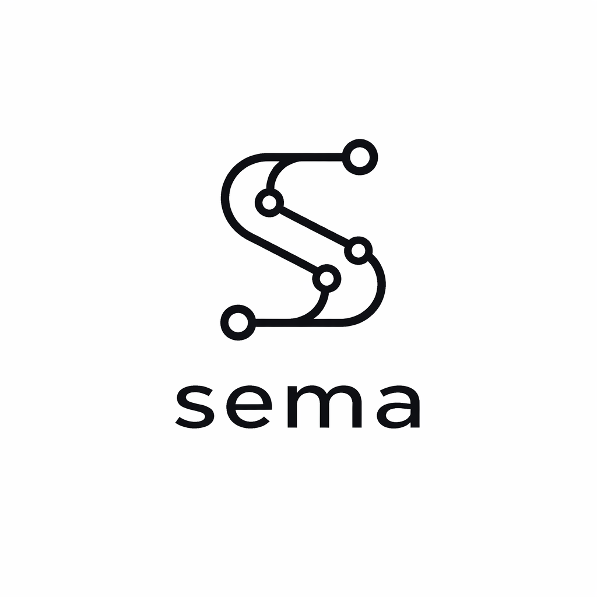

# Sema



Sema e um protocolo de governanca de intencao para IA sobre software vivo. Ela governa contrato, fluxo, erro, efeito, garantia, vinculos, execucao e contexto operacional antes de o agente sair inventando regra, comportamento ou persistencia no chute.

Ela nao tenta substituir framework, ORM, runtime, observabilidade ou banco real. O papel da Sema e dizer o que existe, o que pode mudar e como uma IA deve navegar nisso com menos improviso e mais verificacao.

## Destaques da linha 1.5.3

- persistencia vendor-first de primeira classe para `postgres`, `mysql`, `sqlite`, `mongodb` e `redis`
- `sema drift` com match de codigo vivo para recursos reais desses bancos
- `sema drift` com escopo real e ignorando worktrees ou consumers laterais por padrao
- `sema drift` agora resolve metodos JS/TS browser-side definidos via `Object.assign(...prototype...)`
- entrada padrao da CLI agora prioriza `contratos/`, `sema/` e a pasta atual antes de cair em `exemplos`
- `sema impacto` para mostrar o que tocar, em que ordem, antes da edicao
- `sema renomear-semantico` para guiar renomeacao de payload, store, worker, rota e teste
- `sema verificar` com geracao corrigida de casos inline em TypeScript e Python
- importacao legada que infere blocos `database` e recursos canonicamente
- extensao VS Code com snippets e exemplos separados para cada engine
- CLI, MCP, instaladores e docs alinhados na mesma versao publica

## Instalar

CLI:

```bash
npm install -g @semacode/cli
sema --help
sema doctor
```

MCP opcional:

```bash
npm install -g @semacode/mcp
sema-mcp
```

VS Code:

- VSIX mais recente: <https://github.com/gerlanss/Sema/releases/latest/download/sema-language-tools-latest.vsix>
- pagina de releases: <https://github.com/gerlanss/Sema/releases/latest>

Instaladores:

- Linux/macOS: `curl -fsSL https://raw.githubusercontent.com/gerlanss/Sema/main/install-sema.sh | bash`
- Windows PowerShell: baixe `install-sema.ps1` da branch `main` e rode `.\install-sema.ps1 -WithVSCode -WithMcp`

## Comeco rapido

```bash
mkdir sema-demo
cd sema-demo
sema iniciar
sema validar contratos/pedidos.sema --json
sema resumo contratos/pedidos.sema --micro --para onboarding
```

Fluxo tipico em projeto vivo:

```bash
sema inspecionar . --json
sema drift contratos/pedidos.sema --escopo modulo --json
sema impacto contratos/pedidos.sema --alvo pedido_id --mudanca "trocar pedido_id por pedido_uuid" --json
sema contexto-ia contratos/pedidos.sema --saida ./.tmp/contexto --json
```

## Persistencia vendor-first

Sema 1.5.3 trata banco como superficie semantica de primeira classe, sem fingir que `postgres`, `mysql`, `sqlite`, `mongodb` e `redis` sao a mesma coisa. O contrato canonico agora aceita blocos `database` e recursos como `table`, `collection`, `document`, `keyspace`, `stream`, `relationship`, `query`, `index` e `retention`.

Exemplo curto:

```sema
database principal_postgres {
  engine: postgres
  schema: public
  consistency: forte
  durability: alta
  transaction_model: mvcc
  query_model: sql
  table pedidos {
    entity: Pedido
  }
}
```

Guia completo com os cinco bancos: [docs/persistencia-vendor-first.md](./docs/persistencia-vendor-first.md)

## Pacotes publicos

- `@semacode/cli`: validacao, drift, importacao, compilacao e contexto IA-first
- `@semacode/mcp`: servidor MCP para Claude Code, Cursor, VS Code e clientes compativeis
- `sema-language-tools`: extensao oficial do VS Code

## Documentacao canonica

- [docs/README.md](./docs/README.md)
- [docs/instalacao-e-primeiro-uso.md](./docs/instalacao-e-primeiro-uso.md)
- [docs/cli.md](./docs/cli.md)
- [docs/sintaxe.md](./docs/sintaxe.md)
- [docs/persistencia-vendor-first.md](./docs/persistencia-vendor-first.md)
- [docs/integracao-com-ia.md](./docs/integracao-com-ia.md)
- [docs/importacao-legado.md](./docs/importacao-legado.md)
- [docs/scorecard-compatibilidade.md](./docs/scorecard-compatibilidade.md)
- [docs/roadmap.md](./docs/roadmap.md)

## Extensao VS Code

A extensao agora inclui snippets e exemplos prontos para:

- `persistencia_postgres.sema`
- `persistencia_mysql.sema`
- `persistencia_sqlite.sema`
- `persistencia_mongodb.sema`
- `persistencia_redis.sema`

Ela tambem destaca e explica por hover os blocos novos de persistencia vendor-first.

## Desenvolvimento e release

Build e testes:

```bash
npm run build
npm test
node pacotes/cli/dist/index.js verificar .
```

Empacotar e publicar:

```bash
npm run extensao:empacotar
npm run cli:publicar-npm
npm run mcp:publicar-npm
```
