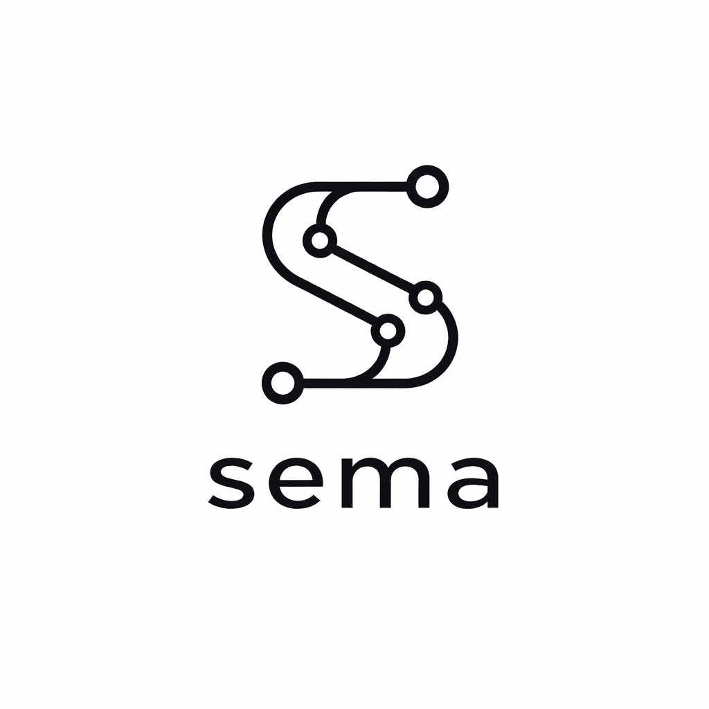

# Sema

<p align="center">
  
</p>

Sema is a Codex-native, local-first semantic governance layer for AI agents.
Codex is its first native integration, not its product ceiling. Sema turns
human intent into explicit contracts, constraints, impact analysis, verified
execution, and evidence instead of asking an agent to rely on prompt context
alone.

`intent -> context -> contract -> constraints -> impact -> execution -> evidence`

## Watch Sema Work in 2:58

https://github.com/user-attachments/assets/62308e14-7e57-4073-8945-c1801bf81498

You tell Codex what you want. Instead of rediscovering the whole repository on
every task, Codex uses Sema's living semantic map to reach the relevant code.
In this real red-to-green demo, Sema catches a partial payment rename, preserves
the `receipt_id` guarantee, and verifies contract, code, tests, drift, and
documentation before closing the change.

**[Watch on YouTube](https://youtu.be/IXkIlC9FxIs)**

Codex is Sema's first native agent integration, and software is its first
proving ground. The same governance model already supports workflows,
operations, games, research, legal review, writing, proposals, conversations,
and other systems where an agent must preserve intent across a real change.

The official Sema agent surface is Codex through `AGENTS.md`. Codex loads this
file as durable repository guidance across its CLI, IDE extension, and desktop
app workflows. See the [Codex `AGENTS.md` documentation](https://learn.chatgpt.com/docs/agent-configuration/agents-md).

Sema is an independent product and is not affiliated with or endorsed by
OpenAI. "Official" in this repository means the official product direction of
Sema, not an official OpenAI program, integration, or submission.

This public repository is intentionally scoped to the local CLI experience.
It does not publish private or sensitive operational material.

Official support: [suporte@otimitare.online](mailto:suporte@otimitare.online)

## What Sema Does

Sema uses `.sema` contracts to describe modules, tasks, inputs, outputs, rules,
guarantees, effects, links to implementation files, and validation expectations.
The current CLI helps Codex answer practical questions before touching a
project:

- which contract applies to the change;
- which files are probably affected;
- whether code and contract have semantic drift;
- which documentation must be read or updated;
- what impact the proposed change has;
- whether a contract can generate starter code or tests.

Sema does not replace human approval, platform policy, security review, or legal
judgment. It is a local governance layer for scope, evidence, drift, and quality.

## Discoverable Pipelines and Interactive Systems

Sema now exposes an explainable capability catalog so an agent can distinguish
governance flows, validation profiles, specialized workflows, orchestration
pipelines, generators, capability tokens, and external adapters before choosing
what to use.

The interactive control plane models games, simulations, and hybrid systems
without coupling the contract to one engine or visual style. Spatial model and
render mode are independent: `THREE_D + HEADLESS` is valid, while XR requires
`THREE_D`; 8-bit and 16-bit remain independent visual profiles. Human-controlled, scripted, AI-controlled,
autonomous, and emergent systems share the same world, time, pipeline, adapter,
and evidence model.

```bash
sema descobrir recomendar --intencao "validate an autonomous calibrated 3D simulator" --json
sema interativo schema --json
sema interativo pipelines --json
sema interativo validar exemplos/sistemas-interativos/simulation-3d-calibrated-autonomous.json --json
```

Interactive catalog entries are external descriptors, not proof that an engine,
editor, plug-in, verifier, or worker is installed or ran. The local
`validar-control-run` binder can prove that a definition, canonical plan,
pipeline contract, schemas, evidence, and validator result belong together, but
even `STRUCTURALLY_COMPLETE` remains non-authoritative and keeps
`completed: false` until an external trust layer attests the run.

See [Capability Discovery](./docs/descoberta-capacidades.md) and
[AI-native Interactive Systems](./docs/sistemas-interativos.md).

## Install

```bash
npm install -g @semacode/cli
codex plugin marketplace add gerlanss/Sema
codex plugin add sema@sema
```

After `codex plugin add`, open a new Codex task in the target repository. Plugin
and skill catalogs are loaded when a task starts, so an already-open task will
not gain `$sema` retroactively. In the new task, invoke `$sema` or ask Codex to
initialize Sema. The skill creates the handshake, reads the generated
`AGENTS.md`, and subsequent tasks load that protocol automatically.

Requirements:

- Node.js 20 or newer;
- a local project folder;
- at least one `.sema` contract before implementation work.

The CLI runs directly after installation. It does not require a Sema login,
user authorization, product-license check, activation key, token, credits, or
control panel. The repository license still governs use and redistribution; it
is not a runtime activation gate.

## Codex Setup

The CLI is the local engine and source of truth. `AGENTS.md` is the automatic
workspace protocol with Codex. The Sema skill is the required bootstrap for a
project that does not have that protocol yet: it teaches Codex to locate the
CLI, run initialization, generate `AGENTS.md`, and then delegate to it.

For a new project:

```bash
sema iniciar --template base
```

Initialization preserves existing project files. `--force` is available only
for an explicit overwrite and is never used automatically by the bootstrap
skill. Symlinks and junctions below the workspace boundary are rejected.

For an existing Sema project:

```bash
sema sync-codex --json
```

Skill installation is explicit and separate: the npm package does not write
into `CODEX_HOME` or silently modify Codex.

## Codex-Native Architecture

- `AGENTS.md` is the only official client entrypoint.
- Agent Context Pack schema version 7 exposes the deterministic capability
  discovery summary alongside `entrypointCodex`, `codexNativo`, and
  `cliLocalSemAutorizacao`.
- Install the Sema Codex skill for first contact in projects that do not yet
  have Sema. Once initialized, the generated `AGENTS.md` owns the governed
  workflow and the skill does not duplicate it.

## Local Workflow

Use the CLI from the project root:

```bash
sema --version
sema resumo
sema docs-impacto --intencao "describe the change" --json
sema inspecionar contratos/sema/software.sema --json
sema drift contratos/sema/software.sema --escopo modulo --json
sema impacto contratos/sema/software.sema --alvo app.software --mudanca "describe the change" --json
```

If a contract changes, validate it:

```bash
sema validar contratos/sema/software.sema --json
sema diagnosticos contratos/sema/software.sema --json
```

Before closing the change, prove the required docs were read:

```bash
sema finalizar-mudanca \
  --intencao "describe the change" \
  --doc-lida AGENTS.md \
  --doc-lida docs/documentation.md \
  --json
```

## Code Generation

Sema can generate starter artifacts from contracts:

```bash
sema compilar contratos/sema/software.sema \
  --alvo typescript \
  --saida .tmp/sema-generated \
  --estrutura modulos
```

Supported generation targets include TypeScript, JavaScript, Python, PHP, Dart,
Lua, HTML, CSS, C#/.NET, and C++. The native targets emit self-contained
projects and executable contract tests: `dotnet` uses the local .NET SDK, while
`cpp` uses GCC, Clang, or MSVC. They are opt-in for project-wide verification,
so projects that do not use native toolchains keep a portable default. Generated
code remains governed by the source `.sema` contract.

## Public Boundary

The public Sema CLI is local-only:

- commands execute directly against the local workspace filesystem;
- no login, user authorization, product-license check, activation key, token,
  credits, billing service, or control panel is required to run them;
- `AGENTS.md` is the official Codex entrypoint;
- the public package ships without secrets or private operational state;
- docs should be written in English for public distribution.

If you are preparing a public release, keep private and sensitive material out
of the repository and out of generated packages.

## Commercial Use

Sema is public source, but it is not a free commercial resale asset. You may use,
study, modify, and share Sema under the license terms, but you may not resell it,
rebrand it as a competing product, offer it as a commercial replica, or bundle
it as a material paid feature without written permission from OtimiTare.

Commercial licensing questions go to [suporte@otimitare.online](mailto:suporte@otimitare.online).

## Useful Commands

```bash
sema ajuda-ia
sema starter-ia
sema prompt-curto contratos/sema/software.sema --json
sema contexto-ia contratos/sema/software.sema --saida .tmp/contexto --json
sema verificar contratos/sema/software.sema --saida .tmp/verificacao --json
```

## License

See [LICENSE](./LICENSE). The license allows public non-commercial use and
prohibits commercial resale or commercial replicas without written permission.
